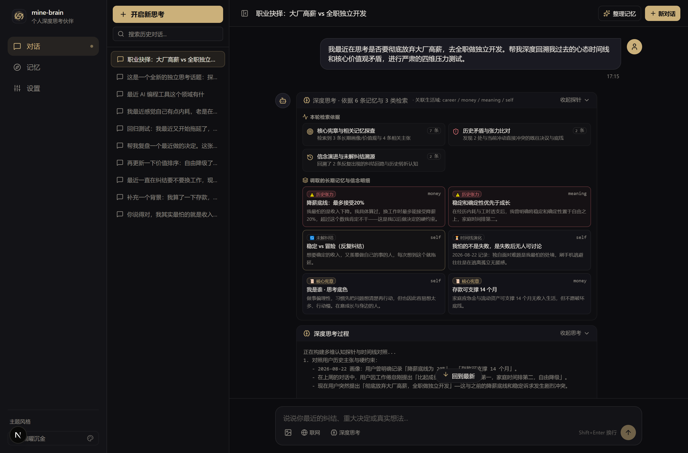
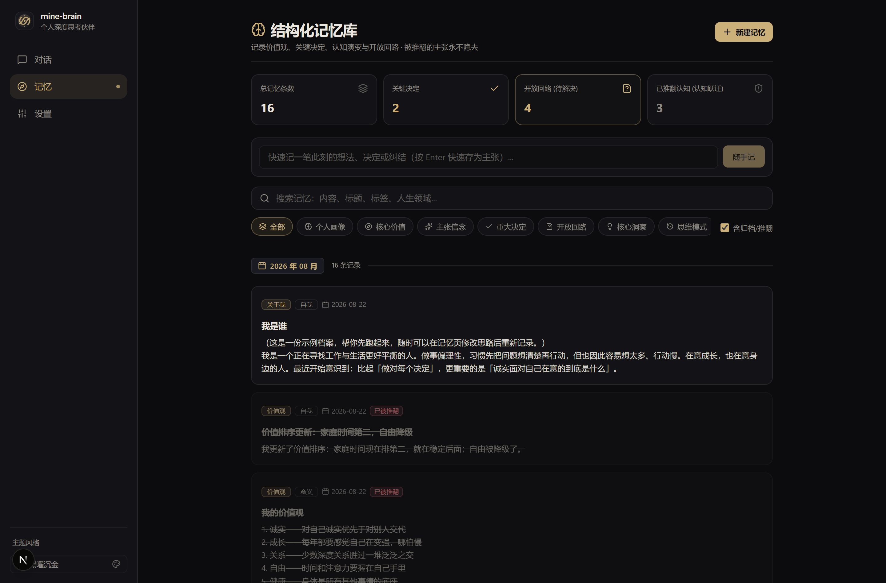
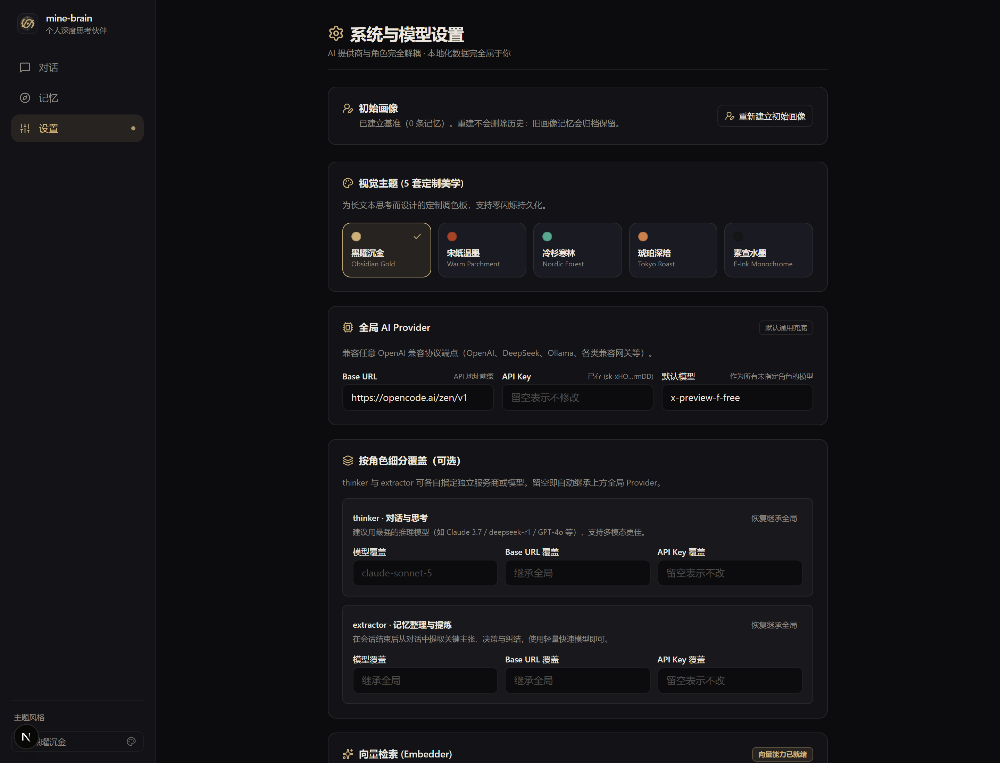

# mine-brain · 个人生活思考伙伴

不是笔记工具，不是知识库 RAG 机器人。这是一个**记得住你、会对照你的过去、敢反驳你**的长期生活思考伙伴。



---

## 💡 它做什么

* **长期记忆与认知沉淀**：价值观、人生阶段焦点、反复纠结（开放回路）、重大决定及其复盘，带完整时间轴沉淀在本地单文件数据库。
* **矛盾对照与历史张力**：你说的话会和过去的你对照——「你三月说过 X，上周因为内耗说了 Y，现在你在说 Z」。改变主意不会被覆盖破坏，旧主张被标记推翻（`superseded`）并建立冲突（`contradicts`）关联边，因为「你曾经怎么想」本身就是不可磨灭的成长轨迹。
* **反方优先与四维压力测试**：回复前先给出认真的反驳、风险与盲点；做决定时自动触发四维决策压力测试（**最坏情况 / 推翻成本 / 三年后回看 / 价值观一致性**），拒绝无意义的谄媚与廉价鸡汤。
* **深度思考模式（Deep Thinking）**：双层认知预算、时间线演进溯源、独立思考折叠卡片与多维认知探针（显式溯源），在同一条流式链路上展开深度探索与反方思辨。
* **多维认知探针**：每次回复显式展示本轮调用的认知依据——核心宪章、历史张力、未解纠结、时间线演化明细，透明可见。
* **自动整理 + 候选确认（Staging）**：每次对话结束后，AI 将值得沉淀的内容抽取为「待确认候选」（主张 / 决定 / 纠结 / 洞察 / 行为模式），你在聊天页逐条确认后才正式入库、打标签、建关联边与向量化——AI 的猜测绝不未经把关就写入长期记忆。
* **联网搜索与外部参考（Web Search）**：可选接入 Exa 搜索引擎与正文抓取（`/contents`），严格标注来源链接与发布时间，且坚决不将外部观点混淆为用户主观记忆。
* **5 套定制主题与跨标签同步**：内置极简纸感、温暖羊皮、深邃墨黑、经典护眼、森林复古 5 套主题，支持亮暗色切换与跨标签页即时同步。
* **后台流式与断点重连**：后台常驻流式写入，切换会话或刷新页面不丢失生成进度，搭配智能滚动感知与防打扰。
* **多模态图片输入**：聊天中直接支持上传/粘贴截图（Vision 格式），直观辅助复盘与决策。
* **100% 数据主权与灾备**：所有数据（含密钥）存在本地 SQLite 单文件，一键脱敏导出 JSON，支持一键导入恢复并具备导入前自动备份与事务失败回滚机制。



---

## 🚀 快速开始

### 方式 A：本地运行（推荐）

要求：Node.js 22.5+（使用内置 `node:sqlite`，零原生编译依赖）与 pnpm。

```bash
# 1. 安装依赖
pnpm install

# 2. 配置环境（可选：也可直接在启动后的「设置」页内图形化填写）
cp .env.example .env.local

# 3. 启动开发服务器
pnpm dev
```

打开浏览器访问 `http://localhost:3000`：
* 引导页写下「关于你」（或先用内置示例档案一键体验）→ 开始你的第一次深聊。
* **不想改文件？** 直接进入「设置」页填写 Base URL / API Key / Model 即可，配置存入本地数据库。

### 方式 B：Docker 一键部署

项目提供了预置的 `docker-compose.yml`（默认绑定 `8088` 端口，挂载 `./data` 保持数据持久化）：

```bash
docker compose up -d
```

---

## 🛠️ 设置与多角色配置

系统将 AI 能力严格拆分为不同角色，可在「设置」页中统一或分别指定不同的服务商、模型与密钥：



* **日常对话与深度思考 (Thinker)**：负责对话编排、多维探针检索与反方思辨（建议配置推理与思考能力强的模型，如 Claude 3.7 Sonnet / DeepSeek-R1 / Qwen 2.5 等）。
* **记忆整理与抽取 (Extractor)**：负责会话后自动抽离结构化候选记忆。
* **向量检索 (Embedder)**：默认接阿里云百炼 `qwen3.7-text-embedding`（1024 维，免费额度内零成本，OpenAI 兼容端点），支持全量重新向量化与自动熔断降级。
* **联网搜索 (Searcher)**：基于 Exa REST API，支持外部知识检索与长文阅读。

---

## 🏗️ 架构与检索哲学

```
Next.js App Router (React 19 + TypeScript + Tailwind CSS v4 + Radix UI)
├─ src/app/            页面与 API 路由（chat SSE 流式 / memories / settings / onboarding）
├─ src/components/     Feature 组件（chat / memories / ui / markdown）
├─ src/lib/providers/  AI Provider 抽象（业务只声明角色，换厂商=改设置，不改代码）
├─ src/lib/memory/     记忆仓库 / 五信号检索融合 / 整理与暂存流水线 / 向量化
├─ src/lib/agent/      思考伙伴人格提示词 + 对话编排器 + 后台常驻流管理器
└─ data/               SQLite 运行时数据库（gitignored，你的全部本地资产）
```

### 五信号融合检索
检索服务于深度思考而非普通文档相似度问答——每次对话动态融合五维信号：
1. **标签命中**（精准语义关联）
2. **生活域匹配**（工作 / 关系 / 家庭 / 健康 / 金钱 / 成长 / 意义 / 自我）
3. **时近度**（记忆的时间衰减与新鲜度）
4. **重要性**（用户标记与系统评估权重）
5. **向量余弦相似度**（捕获字面零重叠的深层语义关联）

此外，系统会**专项沿 `contradicts` / `supersedes` 关联边拉取历史张力素材**，并在深度思考模式下采样构建**时间线演进跨度**。

---

## 🧠 认知记忆模型

| 实体类型 | 含义与定位 |
| :--- | :--- |
| **profile** / **value** | **核心宪章层**：我是谁、做决定的方式、底层价值观排序（新决定取代旧决定，旧版本封口留档）。 |
| **claim** | **主张与信念**：对事物的判断，带生效区间，可被 supersede / contradict。 |
| **decision** | **重要决定**：决定内容 + 决策理由 + 后续复盘状态。 |
| **question** | **开放回路**：反复出现的纠结与未解课题，长期追踪。 |
| **insight** / **pattern** | **深度洞察与行为模式**：整理产出的高层认知与习惯反应。 |

> **领域铁律**：
> 1. **不可变地面真值**：用户的原始对话与输入原文永不修改，所有结构化记忆均可溯源到原始 Entry ID。
> 2. **非破坏性推翻**：当产生新立场时，绝不执行覆盖更新（UPDATE），而是插入新主张、将旧主张标记为 `superseded` 并建立 `contradicts` 边。

---

## 🔒 隐私与数据安全（公网部署必读）

* **数据不出本机**：所有记忆、会话、候选与 API Key 均仅存在本地 `data/mine-brain.db` 单文件中。
* **单用户设计**：本项目是单用户个人应用，**没有内建登录鉴权**——任何能访问该端口的人均可读写你的数据。
* **公网暴露建议**：若部署在云服务器或公网环境，**务必在反向代理层增加鉴权**（如 Tailscale 私有网络、WireGuard、Caddy `basic_auth` 或 Nginx `auth_request`），切勿裸奔至公网。
* **脱敏导出**：导出功能会自动脱敏 API Key，导出的 JSON 文件请妥善保管。

---

## 📜 许可证

[MIT License](LICENSE)
